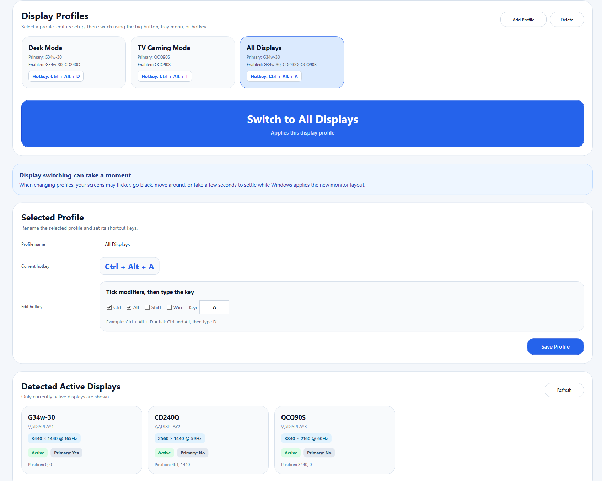

# DisplayDeck

DisplayDeck is a Windows desktop utility for creating and switching between custom display profiles.

It is designed for people who use multiple monitors, TVs, projectors, racing displays, or other screens connected to one PC and want a quick way to switch between different display layouts.

Common examples include desk work, TV gaming, sim racing, presentation setups, streaming layouts, or single-monitor focus modes.

## Screenshot



DisplayDeck can:

- Detect active displays connected to Windows
- Create multiple custom display profiles
- Save which displays are enabled or disabled for each profile
- Set one primary display per profile
- Show friendly display names on profile cards
- Switch profiles using a large button
- Switch profiles from the system tray
- Switch profiles using editable global hotkeys
- Launch an optional app after switching to a profile
- Close an optional launcher app after switching to a profile
- Minimize to the system tray
- Start with Windows
- Run without MultiMonitorTool or external display-switching tools

---

## Display profiles

DisplayDeck is profile-based.

Each profile can store:

- Profile name
- Enabled displays
- Disabled displays
- Primary display
- Custom hotkey
- Optional launcher app
- Optional launcher process name
- Whether to launch the app after switching
- Whether to close the launcher after switching

Example profiles might include:

| Profile | Use |
|---|---|
| Desk Mode | Main monitor and secondary monitor enabled |
| TV Gaming Mode | TV enabled as the primary display |
| All Displays | Main monitor, secondary monitor, and TV enabled |
| Sim Racing Mode | Racing display or cockpit screen enabled |
| Presentation Mode | Projector or TV enabled for presenting |
| Focus Mode | Only one main monitor enabled |

---

## Hotkeys

Each profile can have its own editable hotkey.

For example:

| Profile | Example hotkey |
|---|---|
| Desk Mode | `Ctrl + Alt + D` |
| TV Gaming Mode | `Ctrl + Alt + T` |
| All Displays | `Ctrl + Alt + A` |
| Sim Racing Mode | `Ctrl + Alt + S` |

Hotkeys can use:

- Ctrl
- Alt
- Shift
- Win
- Letters
- Numbers
- Function keys
- Common keys such as Enter, Space, Escape, Home, End, PageUp, and PageDown

DisplayDeck must be running for hotkeys to work. It can run minimized in the system tray.

---

## Example use case

A common setup might include several saved profiles:

| Profile | Displays enabled | Primary display |
|---|---|---|
| Desk Mode | Main monitor and secondary monitor | Main monitor |
| TV Gaming Mode | TV only | TV |
| All Displays | Main monitor, secondary monitor, and TV | Main monitor |
| Sim Racing Mode | Racing display or cockpit screen | Racing display |

Each profile can have its own hotkey and optional launcher actions.

For example, a TV Gaming Mode profile can enable the TV, make it the primary display, disable the desk monitors, and launch a full-screen launcher such as Winhanced, Playnite, Steam Big Picture, or another app.

A Desk Mode profile can return to your normal monitors and close the launcher app.

---

## Important setup note

For initial setup, all displays you want to configure should be powered on, connected, and visible to Windows.

DisplayDeck only shows active displays during setup so inactive virtual or phantom displays stay hidden.

If a TV is physically disconnected, powered off, asleep, or not visible to Windows, Windows may reject the display switch. Turn the TV on, make sure it is on the correct HDMI input, refresh displays, then try again.

---

## Display switching delay

When switching profiles, Windows may take a few seconds to apply the new monitor layout.

During switching, screens may:

- Flicker
- Go black briefly
- Move around
- Reappear in a different order
- Take a few seconds to settle

This is normal.

---

## System tray behavior

DisplayDeck is designed to keep running quietly in the background.

- Minimize button: hides DisplayDeck to the system tray
- Close button: hides DisplayDeck to the system tray
- Tray icon double-click: reopens DisplayDeck
- Tray icon right-click: shows options for opening, switching profiles, or exiting
- Exit DisplayDeck from the tray menu: fully closes the app

---

## Launcher app support

Each profile can optionally launch or close an app after switching.

Examples:

- Winhanced
- Playnite Fullscreen
- Steam Big Picture
- Moonlight
- Sunshine helper tools
- Any other `.exe`

This means you can have one profile that launches a gaming launcher, and another profile that closes it when returning to your normal desktop setup.

Some apps may resist normal close commands, especially if they are running as administrator. If the launcher does not close correctly, try running DisplayDeck with the same permission level as the launcher.

---

## Start with Windows

DisplayDeck includes a Start with Windows option.

When enabled, DisplayDeck adds itself to the current user's Windows startup registry location:

```text
HKCU\Software\Microsoft\Windows\CurrentVersion\Run
```

This only affects the current Windows user.

---

## System requirements

- Windows 10 or Windows 11
- x64 Windows PC
- .NET 8 runtime if running a framework-dependent build
- No separate runtime required if using the self-contained release build

---

## Download

Download the latest compiled version from the [latest DisplayDeck release](https://github.com/G-R3Xx/DisplayDeck/releases/latest).

The recommended download is **DisplayDeck.exe**.

---

## Building from source

Install the .NET 8 SDK.

From the project folder:

```powershell
dotnet restore
dotnet build
dotnet run
```

To create a standalone Windows executable:

```powershell
dotnet publish -c Release -r win-x64 --self-contained true -p:PublishSingleFile=true -p:IncludeNativeLibrariesForSelfExtract=true -p:EnableCompressionInSingleFile=true
```

The published app will be created here:

```text
bin\Release\net8.0-windows\win-x64\publish\DisplayDeck.exe
```

---

## Known limitations

DisplayDeck relies on Windows display APIs.

Because of this:

- A display must be visible to Windows before it can be enabled.
- A disconnected HDMI TV usually cannot be activated until Windows detects it again.
- Some TVs may disappear from Windows when powered off or on the wrong HDMI input.
- Some applications may not close cleanly if they run elevated or use custom full-screen windows.
- Display switching can take a few seconds.

---

## Project status

DisplayDeck is currently an early public release.

Current features include:

- Multiple custom display profiles
- Native Windows display switching
- Active display detection
- Per-profile hotkeys
- Per-profile launcher actions
- System tray switching
- Start with Windows
- Friendly display names on profile cards
- One primary display per profile

Future improvements may include:

- Profile import/export
- Optional controller shortcut support
- Per-profile audio switching
- Installer package
- Improved profile icons
- Advanced display arrangement editing

---

## License

DisplayDeck is released under the MIT License.

See [LICENSE](LICENSE) for details.